<div align="center">

[](README.md)&nbsp;[](README.de.md)&nbsp;[](README.ar.md)


# Stock Manager Pro

**إدارة مخزون احترافية لسطح المكتب على نظام Windows**

محلي أولاً · يدعم الباركود · مزامنة سحابية بين أجهزة متعددة · ثلاثي اللغة (الإنجليزية / الألمانية / العربية)

[](https://github.com/Oranovix/stock-manager-pro/releases/latest)
[](https://github.com/Oranovix/stock-manager-pro/releases/latest)
[](EULA.md)

[**⬇ تنزيل أحدث مُثبِّت**](https://github.com/Oranovix/stock-manager-pro/releases/latest) · [المزايا](#-المزايا) · [لقطات الشاشة](#-لقطات-الشاشة) · [الإصدارات](EDITIONS.md) · [سجل التغييرات](CHANGELOG.md) · [الإبلاغ عن مشكلة](https://github.com/Oranovix/stock-manager-pro/issues)

</div>

---

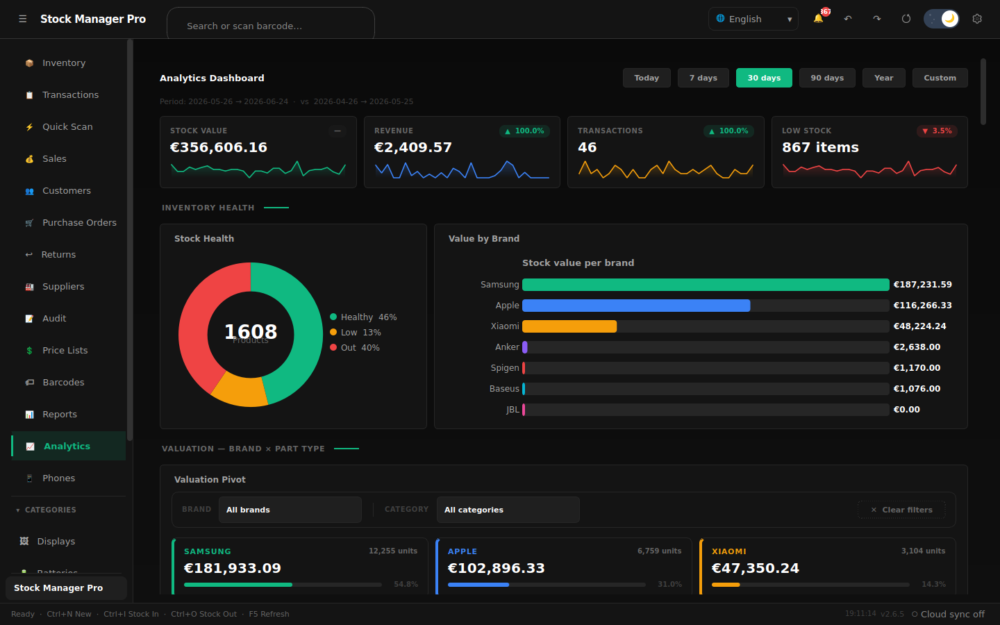

<div dir="rtl">

## نظرة عامة

Stock Manager Pro هو تطبيق احترافي لإدارة المخزون على سطح المكتب يعمل بمبدأ "المحلي أولاً"، مُصمَّم لورش الإصلاح الصغيرة والمتوسطة ومتاجر التجزئة والمستودعات. يأتي مزوَّداً بمجموعة كاملة لإدارة العمليات التجارية — نقطة بيع متكاملة (POS)، ودورة حياة أوامر الشراء، وعمليات جرد المخزون، وقوائم الأسعار، ونظام إدارة علاقات الموردين، ومخزون متعدد المواقع، **وتتبُّع الهواتف فردياً عبر رقم IMEI**، و**14 تقريراً بصيغة PDF بعلامة تجارية** — وكل ذلك مبني على محرّك غير متزامن لا يتجمّد، وبنية طبقية نظيفة. تبقى البيانات محلية افتراضياً، مع **مزامنة سحابية اختيارية بين أجهزة متعددة** عند الحاجة.

مُصمَّم للمتاجر الحقيقية التي تحتاج إلى معرفة **ما هو متوفر في المخزون بالضبط، وكم قيمته، وما الذي بِيع اليوم** — دون خادم، ودون اشتراك في سحابة طرف آخر، ودون اتصال بالإنترنت.

- **المحلي أولاً.** تعيش بياناتك في ملف قاعدة بيانات على جهازك. التطبيق يعمل بكامل وظائفه دون اتصال. النسخ الاحتياطي بنقرة واحدة، والتصدير (CSV/JSON) متاح دائماً.
- **كل شيء بالباركود.** أنشئ الملصقات، وامسح باستخدام أي ماسح USB، واستخدم سير عمل المسح السريع للاستلام والبيع وفحص المخزون.
- **مزامنة سحابية بين أجهزة متعددة** (النسخة الاحترافية). يتشارك جهازان أو أكثر مجموعة بيانات حيّة واحدة — يرى منضدة المتجر والمكتب الخلفي المخزون نفسه دائماً.
- **متعدد اللغات حقاً.** كل شاشة بالإنجليزية والألمانية والعربية (دعم كامل للكتابة من اليمين إلى اليسار)، قابلة للتبديل أثناء التشغيل.

---

## ✨ المزايا

### المخزون الأساسي
- مخزون موحَّد عبر الفئات وأنواع القطع وموديلات الهواتف ومتغيرات الألوان
- **عرض المصفوفة الشبكي** — مخزون مجمَّع بأسلوب جداول البيانات عبر الموديل × نوع القطعة × اللون، مع عمود موديل مثبَّت، ورؤوس ثابتة، ومجاميع القيمة لكل نوع قطعة
- **وحدات الهواتف (تتبُّع IMEI)** — تتبَّع الأجهزة الكاملة فردياً عبر رقم IMEI: السعة، والحالة، ونسبة البطارية، وسعر الشراء/البيع، والحالة (متوفر / مُباع / محجوز)، وملصقات الباركود، وسجل المبيعات، وسجل تدقيق كامل *(وحدة اختيارية)*
- إدخال / إخراج / تعديل المخزون مع ملاحظات مؤرَّخة وتراجع / إعادة كاملين
- عتبات حد أدنى للمخزون لكل صنف مع تنبيهات فورية لانخفاض المخزون
- صور المنتجات وتواريخ انتهاء الصلاحية وتتبُّع الضمان لكل صنف
- توليد الباركود (Code128/EAN) واعتراض إدخال ماسح USB

### وحدات الأعمال
| الوحدة | أبرز الميزات |
|---|---|
| **المبيعات / نقطة البيع** | نقطة بيع قائمة على السلة، بحث عن العملاء، خصومات، إيصالات PDF، تعديل/إلغاء مع عكس تلقائي للمخزون |
| **الهواتف (IMEI)** | مخزون الأجهزة عبر IMEI — شبكة مخزون العلامة × الموديل، المسح للبيع، الحجز، ملصقات الباركود، سجل المبيعات |
| **أوامر الشراء** | دورة حياة مسودة ← مُرسَل ← جزئي ← مُستلَم، إدخال تلقائي للمخزون عند الاستلام |
| **المرتجعات** | إجراءات إعادة التخزين أو الشطب، تتبُّع المبالغ المستردة، الربط بالبيع |
| **الموردون** | إدارة علاقات الموردين، أسعار التكلفة، أيام التوريد، الأصناف المرتبطة |
| **قوائم الأسعار** | إنشاء وتسويد وتفعيل وتطبيق جماعي لتكوينات الأسعار |
| **الجرد / التدقيق** | مقارنة دورية بين الكمية المعدودة وكمية النظام مع تقرير الفروقات |
| **العملاء** | ملفات العملاء مرتبطة بسجل المبيعات والمشتريات |
| **المواقع** | مخزون متعدد المواقع مع تحويلات بين مواضع المستودع |
| **التقارير** | 14 تقريراً بصيغة PDF بعلامة تجارية — المخزون، التقييم (بالتكلفة)، انخفاض المخزون، المعاملات، المبيعات، أداء الفئات، التدقيق، **مخزون الهواتف وسجل مبيعاتها**، ملصقات الباركود، وأكثر |

### المنصة
- **واجهة لا تتجمّد** — كل عملية على قاعدة البيانات تُنفَّذ خارج الخيط الرئيسي؛ لا تتوقف الواجهة أبداً مهما كان حجم البيانات
- **مزامنة سحابية اختيارية** — شارك مجموعة بيانات حيّة عبر أجهزة متعددة؛ لا خادم لتشغيله، تُفعَّل لكل تثبيت
- **وحدات اختيارية** — الميزات الخاصة بالمتجر (مثل متتبِّع الهواتف / IMEI) تُفعَّل لكل تثبيت عبر إعدادات المتجر ← الوحدات
- **متعدد اللغات** — الإنجليزية والألمانية (DE) والعربية (AR) مع تبديل فوري وتخطيط كامل من اليمين إلى اليسار
- **أربعة سمات** — داكن، فاتح، احترافي داكن (زمردي/فحمي)، احترافي فاتح (زمردي/أبيض)
- **تكبير بأسلوب Excel** — التكبير عبر Ctrl+التمرير / Ctrl+زائد/ناقص (50–200٪) مع منزلق في التذييل
- **تحديث تلقائي** — فحص الإصدار المعتمد على البيان مع تحقُّق SHA256
- **نسخ احتياطي تلقائي** — نسخ مجدول مع مدة احتفاظ قابلة للتكوين
- **تراجع / إعادة** — عكس أي عملية مخزون أو حالة هاتف
- **دون اتصال أولاً** — قاعدة بيانات محلية (WAL)، بلا قياس عن بُعد؛ المزامنة السحابية اختيارية بشكل صارم

---

## 📸 لقطات الشاشة

> تستخدم لقطات الشاشة مجموعة بيانات تجريبية.

### لوحة معلومات التحليلات
بطاقات مؤشرات أداء فورية (قيمة المخزون بالتكلفة، الإيرادات، المعاملات، انخفاض المخزون)، ورسم دائري لصحة المخزون، وأعمدة القيمة حسب العلامة، وجدول محوري لتقييم العلامة × نوع القطعة — كل ذلك مُحمَّل بشكل غير متزامن خارج خيط الواجهة.


---

### عرض المصفوفة
سير العمل الأساسي — مخزون مجمَّع بأسلوب جداول البيانات عبر الموديل × نوع القطعة × اللون، مع عمود موديل مثبَّت، ومجاميع القيمة لكل نوع قطعة، ومرشّحات منخفض / نفد / إعادة الطلب.

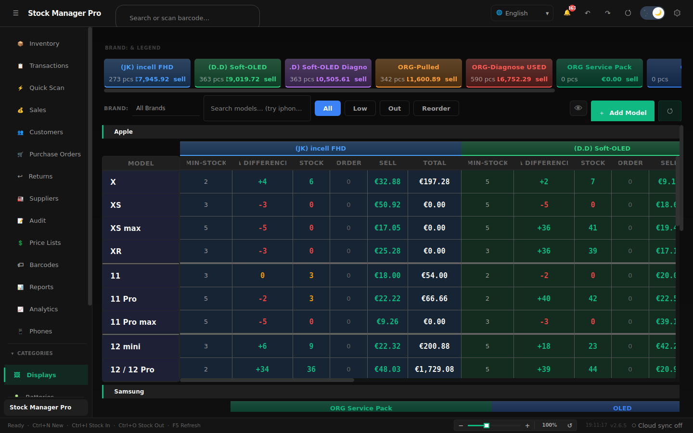

---

### المخزون
جدول منتجات قابل للبحث والتصفية مع بطاقات نظرة عامة للمؤشرات (الوحدات، منخفض / نفد المخزون، قيمة المخزون)، وشارات الحالة، وإجراءات مخزون سريعة مضمَّنة +1 / −1.

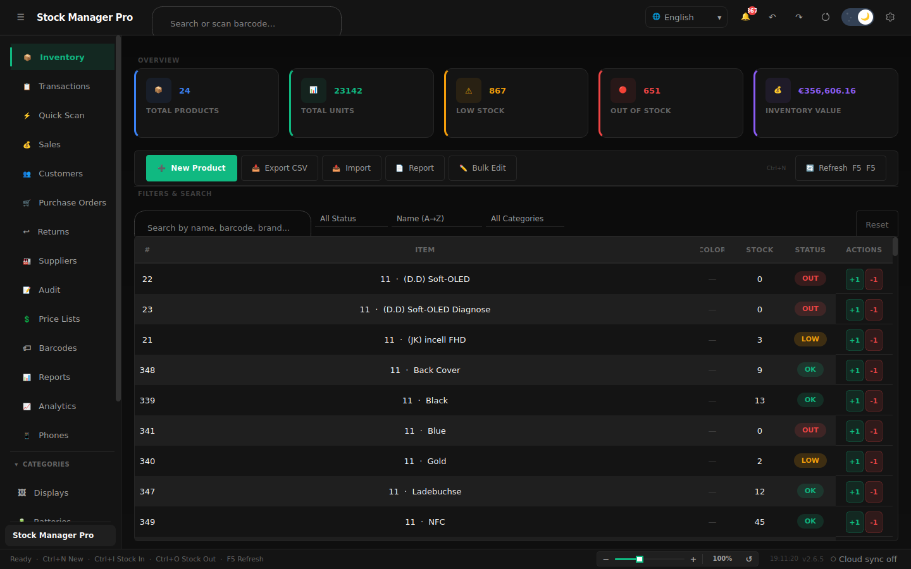

---

### الهواتف — تتبُّع IMEI
مخزون الأجهزة مُتتبَّع عبر IMEI: شبكة مخزون العلامة × الموديل حسب السعة، ومؤشرات (الإجمالي / المتوفر / المُباع / متوسط البطارية / قيمة المخزون)، والمسح للبيع، والحجز، وملصقات الباركود. *(وحدة اختيارية.)*

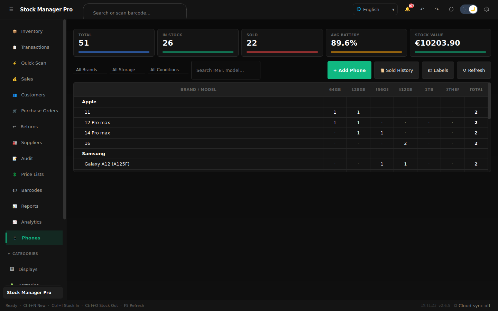

---

### المبيعات ونقطة البيع
نقطة بيع قائمة على السلة مع مُنتقي المنتجات، والبحث عن العملاء، والخصومات، وإيصالات PDF التلقائية، والتعديل / الإلغاء مع عكس المخزون.

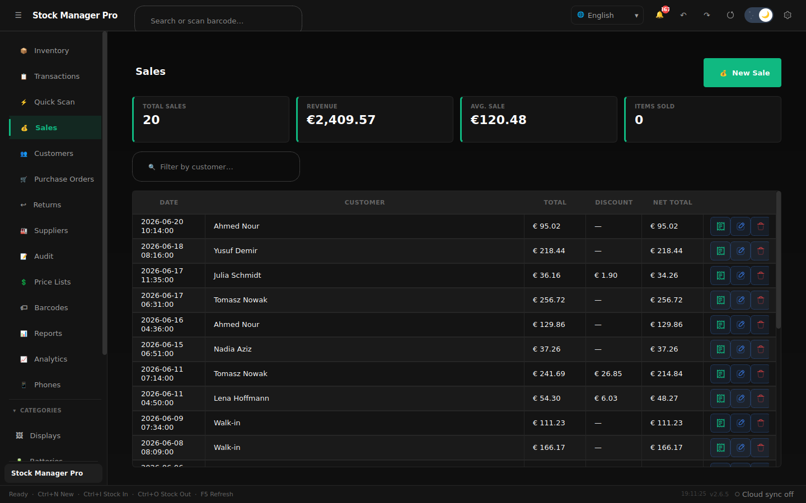

---

### التقارير
14 تقريراً احترافياً بصيغة PDF بعلامة تجارية **للقطع والهواتف** — المخزون، التقييم (بالتكلفة)، انخفاض المخزون، المعاملات، المبيعات، أداء الفئات، أوراق التدقيق، مخزون الهواتف وسجل مبيعاتها، المخزون منتهي الصلاحية، وملصقات الباركود.

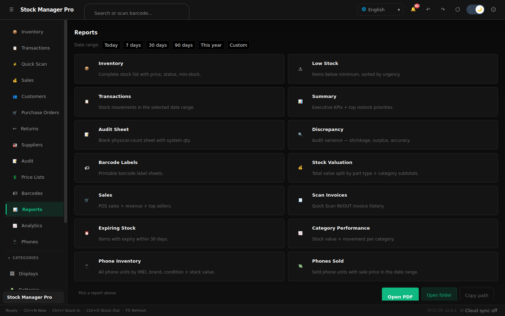

---

### المعاملات
سجل تدقيق مُقسَّم إلى صفحات لحركة المخزون مع شريط ملخّص إدخال / إخراج / تعديل / الصافي، ومرشّحات مُخمَّدة، وترقيم صفحات بأسلوب "تحميل المزيد".

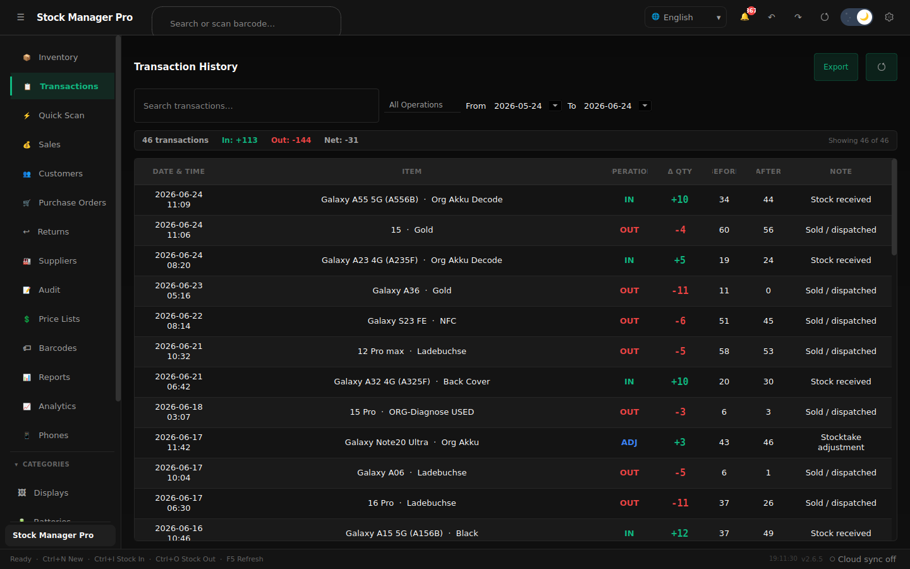

---

### أوامر الشراء
دورة حياة كاملة لأمر الشراء من مسودة عبر مُرسَل ← جزئي ← مُستلَم. يؤدي استلام أمر الشراء تلقائياً إلى إدخال المخزون.

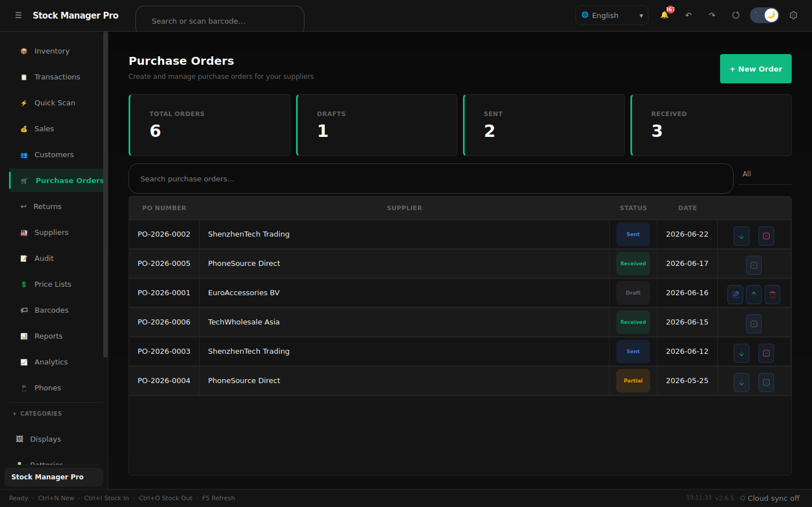

---

### الموردون
إدارة علاقات الموردين مع تفاصيل الاتصال، والتقييم، والأصناف المرتبطة، وعدد أوامر الشراء المفتوحة لكل مورد.

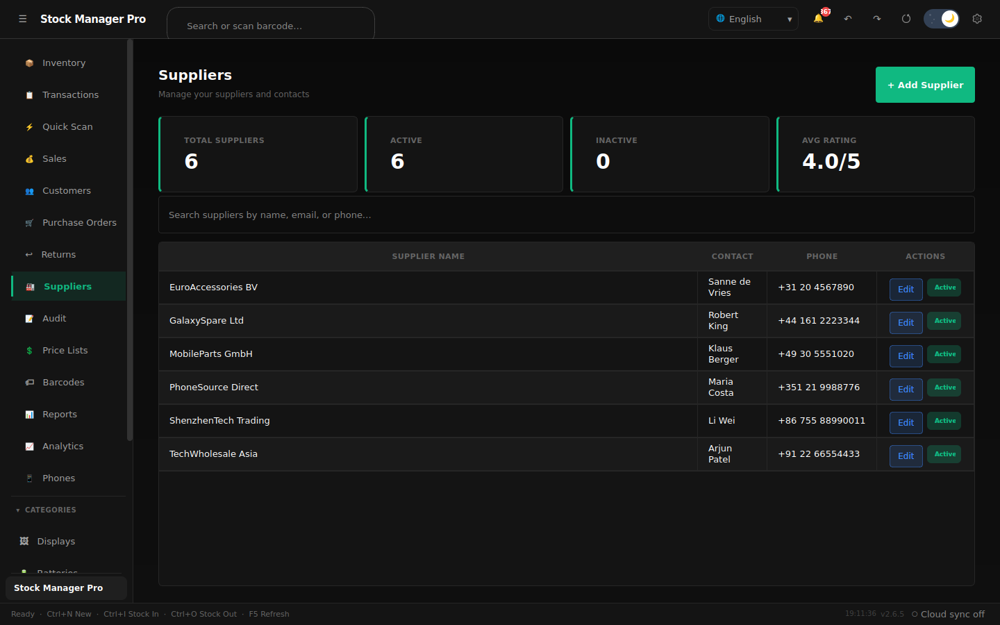

---

### الجرد والتدقيق
جرد دوري مع إدخال الكمية المعدودة صنفاً بصنف، وتقرير فروقات النظام مقابل المعدود، وملخّص إتمام.

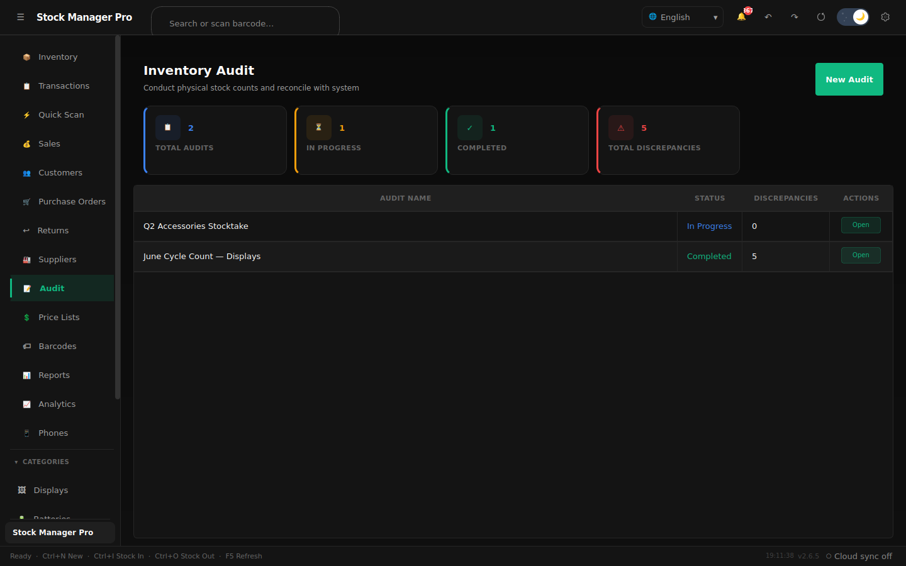

---

### قوائم الأسعار
أنشئ وأدِر تكوينات الأسعار؛ طبِّق نسبة زيادة جماعية أو ادفع قائمة مباشرة إلى المخزون الحيّ.

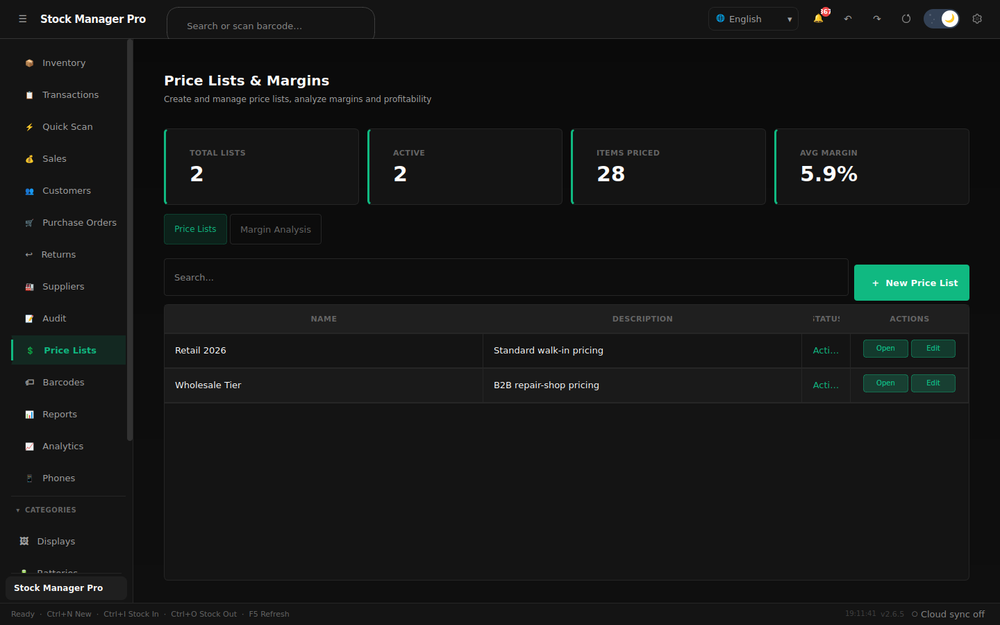

---

### المرتجعات
عالِج المرتجعات بإجراءات إعادة التخزين أو الشطب — يعكس المعاملة الأصلية ويسجِّل مبلغ الاسترداد.

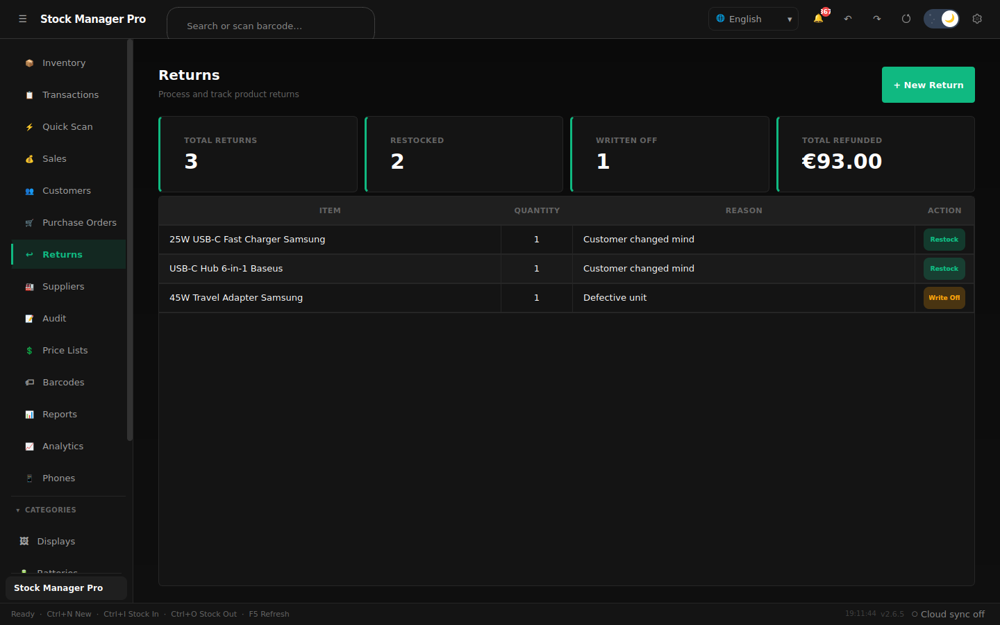

---

### المسح السريع
اعتراض إدخال ماسح الباركود USB مع باركودات أوامر (إخراج / إدخال / تأكيد) لعدّ المخزون دون استخدام اليدين.

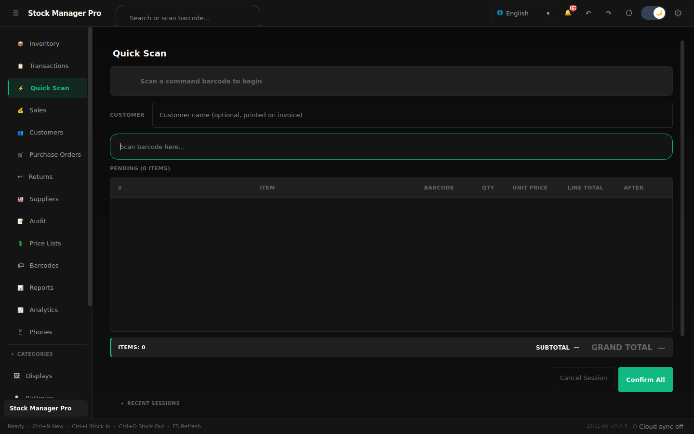

---

### مولِّد الباركود
أنشئ وصدِّر باركودات Code128 / EAN؛ اطبع الملصقات دفعةً واحدة للمخزون الجديد.

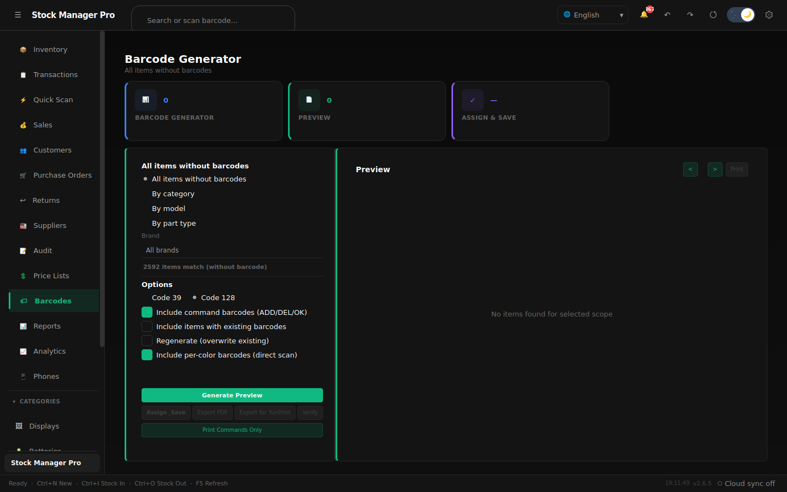

---

## 🖥️ متطلبات النظام

| | |
|---|---|
| **نظام التشغيل** | Windows 10 أو Windows 11 (64 بت) |
| **الذاكرة** | 512 ميجابايت كحد أدنى · 2 جيجابايت مُوصى به |
| **القرص** | 250 ميجابايت للتطبيق + مساحة قاعدة البيانات |
| **صلاحيات المسؤول** | غير مطلوبة |
| **الإنترنت** | غير مطلوب للاستخدام اليومي (فحص التحديث والمزامنة السحابية اختياريان) |

---

## الإصدارات

| | **المجاني** | **الاحترافي** |
|---|---|---|
| المخزون الأساسي، المصفوفة، الباركود، نقطة البيع | ✅ | ✅ |
| تقارير PDF | 3 أساسية | **الـ 14 جميعها** |
| الأجهزة / المزامنة السحابية | جهاز واحد، محلي | **أجهزة متعددة، سحابة مشتركة** |
| وحدة الهواتف / IMEI | — | ✅ |
| أوامر الشراء، قوائم الأسعار، الجرد | تجريبي | ✅ |

المقارنة الكاملة والالتزامات: [EDITIONS.md](EDITIONS.md)

---

## 📦 التثبيت

1. [نزِّل أحدث ملف `StockManagerPro-x.y.z-setup.exe`](https://github.com/Oranovix/stock-manager-pro/releases/latest)
2. شغِّل المُثبِّت — تُحفَظ البيانات الحالية عند التحديثات
3. يفحص التطبيق التحديثات تلقائياً؛ يُنشَر كل إصدار هنا

تُخزَّن البيانات في `%LOCALAPPDATA%\StockPro\StockManagerPro\stock_manager.db` — دون صلاحيات مسؤول، ودون حساب، ودون اتصال بالإنترنت للاستخدام اليومي.

---

## 🚀 البدء السريع

| المهمة | الطريقة |
|---|---|
| الإعداد لأول مرة | أكمِل معالج الإعداد عند أول تشغيل |
| إضافة منتج | `Ctrl+N` أو زر **+ إضافة منتج** |
| إدخال مخزون | اختر المنتج ← `Ctrl+I` |
| إخراج مخزون | اختر المنتج ← `Ctrl+O` |
| تعديل المخزون | اختر المنتج ← `Ctrl+J` |
| فتح نقطة البيع | انتقل إلى **المبيعات / نقطة البيع** ← بيع جديد |
| توليد باركود | نقر يمين على المنتج ← توليد باركود أو `Ctrl+B` |
| تصدير تقرير PDF | انتقل إلى **التقارير** أو `Ctrl+P` |
| إعدادات المسؤول | `Ctrl+Alt+A` أو أيقونة ⚙ في الشريط العلوي |
| تبديل اللغة | مبدِّل اللغة في الشريط العلوي (EN / DE / AR) |
| التراجع عن آخر عملية | نقر يمين على المعاملة ← تراجع |
| فرض التحديث | `F5` |

---

## 🏗️ البنية

يُبنى Stock Manager Pro على بنية طبقية صارمة مع محرّك غير متزامن لا يتجمّد — لا تستعلم الواجهة عن قاعدة البيانات مباشرةً أبداً ولا تتوقف أبداً.

</div>

```
┌──────────────────────────────────────────────────────────────┐
│  طبقة الواجهة  —  الصفحات · المكوّنات · الحوارات · التبويبات · المتحكّمات │
├──────────────────────────────────────────────────────────────┤
│  المحرّك غير المتزامن  —  WorkerPool · DataWorker · UpdateWorker │
├──────────────────────────────────────────────────────────────┤
│  طبقة الخدمات  —  منطق الأعمال (21 خدمة)                        │
├──────────────────────────────────────────────────────────────┤
│  طبقة المستودعات  —  وصول بيانات بلغة SQL فقط (13 مستودعاً)     │
├──────────────────────────────────────────────────────────────┤
│  طبقة النماذج  —  فئات بيانات نطاقية صرفة (13 نموذجاً)          │
├──────────────────────────────────────────────────────────────┤
│  الطبقة الأساسية  —  قاعدة البيانات · السمة · i18n · التهيئة · السجل │
│  SQLite WAL · مخطط V23 · 27 جدولاً · مزامنة سحابية اختيارية     │
└──────────────────────────────────────────────────────────────┘
```

<div dir="rtl">

**المحرّك غير المتزامن الذي لا يتجمّد** — تُنفَّذ كل عملية على قاعدة البيانات خارج الخيط الرئيسي عبر مجمع عمّال يدعم الإلغاء الموجَّه وإدخال المرشّحات المُخمَّد. يطبِّق الخيط الرئيسي النتائج فقط؛ ولا يستعلم أبداً. تُؤجَّل تغييرات السمة إلى الدورة التالية لحلقة الأحداث لإزالة أي تجمُّد عند التبديل.

**قاعدة بيانات مُحسَّنة** — مجمع اتصالات محلي للخيط، وإدخالات مجمَّعة، وفهارس أداء، وإعدادات pragma مضبوطة. تعمل سلسلة ترحيل تلقائية كاملة (المخطط V1 ← V23) عند كل بدء تشغيل، بحيث لا تتطلّب الترقيات أي عمل يدوي على البيانات. يغطّي 27 جدولاً المخزون والمبيعات وأوامر الشراء والمرتجعات والموردين والعملاء والمواقع وعمليات الجرد وقوائم الأسعار والهواتف (IMEI) وسجلّات تدقيقها.

---

## 🛠️ حزمة التقنيات

| الطبقة | التقنية | الغرض |
|---|---|---|
| إطار الواجهة | **PyQt6** | واجهة سطح مكتب أصلية |
| قاعدة البيانات | **SQLite 3** (WAL + FK) | تخزين علائقي محلي |
| PDF | **fpdf2** + **PyMuPDF** | التقارير والإيصالات |
| الباركود | **python-barcode** | توليد Code128 / EAN |
| الصور | **Pillow** | صور المنتجات ومعالجة الأيقونات |
| التحزيم | **PyInstaller** | ملف تنفيذي لنظام Windows |

---

## ⌨️ اختصارات لوحة المفاتيح

| الإجراء | الاختصار | الإجراء | الاختصار |
|---|---|---|---|
| منتج جديد | `Ctrl+N` | توليد باركود | `Ctrl+B` |
| إدخال مخزون | `Ctrl+I` | تصدير تقرير PDF | `Ctrl+P` |
| إخراج مخزون | `Ctrl+O` | تكبير / تصغير | `Ctrl+=` / `Ctrl+-` |
| تعديل المخزون | `Ctrl+J` | إعادة تعيين التكبير | `Ctrl+0` |
| بحث | `Ctrl+F` | إعدادات المسؤول | `Ctrl+Alt+A` |
| حذف منتج | `Del` | فرض التحديث | `F5` |

---

## 🔒 البيانات والخصوصية

تبقى جميع البيانات على جهازك:

</div>

```
%LOCALAPPDATA%\StockPro\StockManagerPro\stock_manager.db
```

<div dir="rtl">

- لا حاجة لاتصال بالإنترنت (فحص التحديث اختياري)
- بلا قياس عن بُعد، ولا تتبُّع للمستخدم؛ المزامنة السحابية اختيارية بشكل صارم (قاعدة بياناتك السحابية الخاصة)
- سجل تدقيق كامل لكل حركة مخزون
- نسخ احتياطي تلقائي مع مدة احتفاظ قابلة للتكوين
- وضع SQLite WAL لأمان ضد الأعطال

---

## 📈 الإصدارات

يُبنى كل إصدار ويُنشَر هنا تلقائياً — المُثبِّت، وملف `update_manifest.json` (مُتحقَّق منه بـ SHA256)، وسجل التغييرات. يوجد السجل الكامل لكل إصدار في **[CHANGELOG.md](CHANGELOG.md)**.

| المرحلة | أبرز الميزات |
|---|---|
| **2.7.x** | تعزيز المزامنة السحابية بين أجهزة متعددة، إصلاحات دور النسخة المتماثلة، أتمتة خط الإصدار |
| **2.6.x** | إصلاح تفعيل المزامنة السحابية، دقة صحة المخزون في اللوحة، لقطات شاشة محدَّثة |
| **2.5.x** | 📱 وحدة الهواتف (IMEI)، مزامنة سحابية اختيارية، 14 تقرير PDF احترافي، إصلاحات باركود للوحات المفاتيح الألمانية |
| **2.3.x** | محرّك غير متزامن لا يتجمّد، إعادة هيكلة المتحكّمات، مجموعة أعمال كاملة (نقطة البيع، أوامر الشراء، المرتجعات، الموردون، الجرد، قوائم الأسعار، العملاء، المواقع) |
| **2.1 – 2.2** | بُعد اللون في المصفوفة، مولِّد الباركود، سير عمل المسح السريع |
| **1.0.0** | المخزون الأساسي، مسح الباركود، واجهة متعددة اللغات، SQLite دون اتصال |

---

## الدعم

- 🐛 [الإبلاغ عن خطأ](https://github.com/Oranovix/stock-manager-pro/issues/new?template=bug_report.md)
- 💡 [اقتراح ميزة](https://github.com/Oranovix/stock-manager-pro/issues/new?template=feature_request.md)
- 💼 الترخيص التجاري والنشر متعدد المتاجر: تواصل مع [Oranovix](https://github.com/Oranovix)

---

## 📄 الترخيص

Stock Manager Pro هو برنامج تجاري © 2026 Oranovix / Abdullah Bakir.
المُثبِّتات على هذه الصفحة مُرخَّصة بموجب [اتفاقية ترخيص المستخدم النهائي](EULA.md).
تبقى بياناتك ملكك دائماً — التصدير والنسخ الاحتياطي وصلاحية القراءة تعمل في كل إصدار، مُرخَّص أو غير مُرخَّص.

</div>

---

<div align="center">

**[تنزيل](https://github.com/Oranovix/stock-manager-pro/releases/latest)** · **[الإبلاغ عن خطأ](https://github.com/Oranovix/stock-manager-pro/issues)** · **[اقتراح ميزة](https://github.com/Oranovix/stock-manager-pro/issues/new?template=feature_request.md)**

نتمنى لك إدارة مخزون موفَّقة 🚀

</div>
