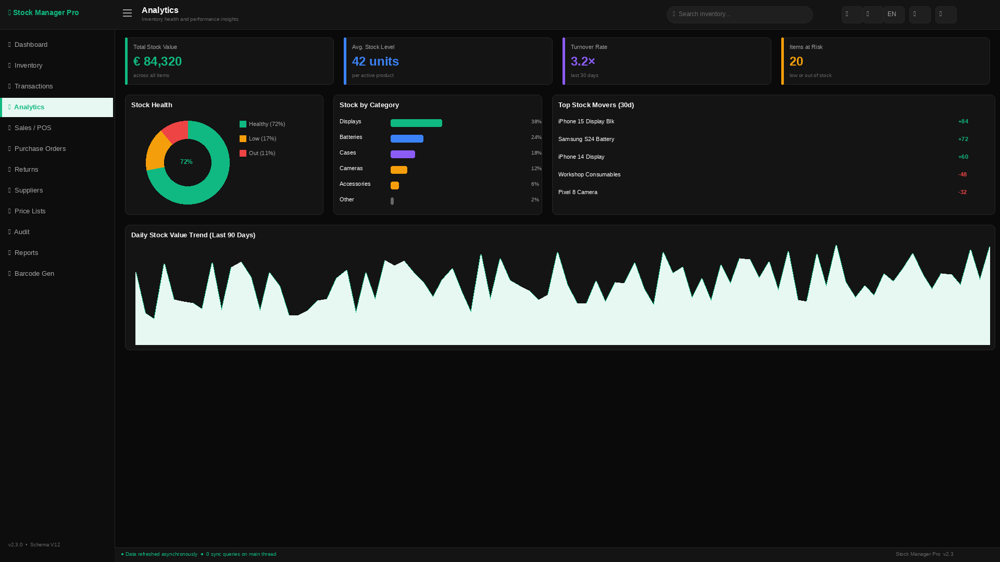

# Stock Manager Pro

**Professional desktop inventory management for Windows**
Local-first · barcode-aware · multi-PC cloud sync · trilingual (EN / DE / AR)

[**⬇ Download the latest installer**](https://github.com/Oranovix/stock-manager-pro/releases/latest) · [Editions](EDITIONS.md) · [Changelog](CHANGELOG.md) · [Report a problem](https://github.com/Oranovix/stock-manager-pro/issues)

---

## Why Stock Manager Pro

Built for real shops — phone-repair and retail businesses that need to know
**exactly what's in stock, what it's worth, and what sold today**, without a
server, a subscription to someone else's cloud, or an internet connection.

- **Local-first.** Your data lives in a database file on your PC. The app is
  fully functional offline. Backups are one click, and exports (CSV/JSON) are
  always available.
- **Barcode everything.** Generate labels, scan with any USB scanner, and use
  the Quick-Scan workflow for receiving, selling, and stock checks.
- **Multi-PC cloud sync** (Pro). Two or more PCs share one live dataset — the
  shop counter and the back office always see the same stock.
- **Truly multilingual.** Every screen in English, German, and Arabic (full
  RTL support), switchable at runtime.

## Feature tour

| | |
|---|---|
|  |  |
| **Inventory** — search-as-you-type, per-item history, min-stock alerts | **Matrix view** — model × part-type grid with per-color stock at a glance |
|  |  |
| **Analytics** — revenue, profit, top items, top customers | **Barcode studio** — batch label generation, printer-ready PDFs |

**Plus:** POS with PDF receipts · customer accounts · purchase orders ·
supplier management · returns & write-offs · price lists · stock audits ·
14 PDF report types · role-separated admin area · automatic backups ·
auto-updates.

## Editions

| | **Free** | **Pro** |
|---|---|---|
| Core inventory, matrix, barcodes, POS | ✅ | ✅ |
| PDF reports | 3 core | **All 14** |
| PCs / cloud sync | 1 PC, local | **Multi-PC shared cloud** |
| Phones / IMEI module | — | ✅ |
| Purchase orders, price lists, audits | Trial | ✅ |

Full comparison and commitments: [EDITIONS.md](EDITIONS.md)

## Install

1. [Download the latest `StockManagerPro-x.y.z-setup.exe`](https://github.com/Oranovix/stock-manager-pro/releases/latest)
2. Run the installer — existing data is preserved on updates
3. The app checks for updates automatically; every release is published here

**Requirements:** Windows 10/11, 64-bit. No server, no account, no internet required for daily use.

## Support

- 🐛 [Report a bug](https://github.com/Oranovix/stock-manager-pro/issues/new?template=bug_report.md)
- 💡 [Request a feature](https://github.com/Oranovix/stock-manager-pro/issues/new?template=feature_request.md)
- 💼 Commercial licensing & multi-shop deployments: contact [Oranovix](https://github.com/Oranovix)

## License

Stock Manager Pro is commercial software © 2026 Oranovix / Abdullah Bakir.
The installers on this page are licensed under the [End-User License Agreement](EULA.md).
Your data always remains yours — export, backups, and read access work in
every edition, licensed or not.
